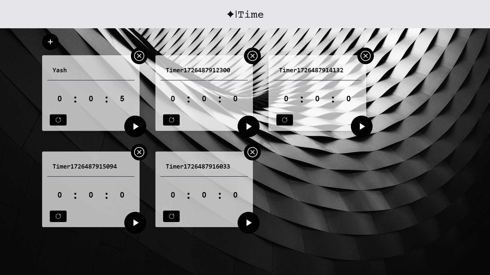

# ⏰ Timer App

Welcome to the **Timer App**! This is a simple, clean, and modern timer application built using cutting-edge technologies. The app allows users to start, stop, and reset a timer, with a beautiful UI.

🚀 **Live Demo**: [Timer App on Vercel](https://timers-chi.vercel.app/)

---

## 🌟 Features

- ⏳ Start, Stop, and Reset functionality
- 🎨 Beautiful UI with TailwindCSS
- 📱 Responsive design
- 🔥 Firebase integration for future enhancements

---

## 🛠️ Tech Stack

 
 
 
 
 


---

## 📸 Screenshots



---

## 🚀 Deployment

This app is deployed using **Vercel** for continuous deployment and easy access.

---

## 📂 Project Structure

```bash
├── public
│   ├── oversimplified-alarm-clock.svg
│   ├── timer.svg
│   └── TimerComponent.jsx
├── src
│   ├── assets
│   │   ├── cool-background.png
│   │   ├── oversimplified-alarm-clock.svg
│   │   ├── react.svg
│   │   └── timer.svg
│   ├── components
│   │   └── TimerComponent.jsx
│   ├── db
│   ├── App.css
│   ├── App.jsx
│   ├── index.css
│   └── main.jsx
├── .gitignore
├── eslintrc.config.js
├── index.html
├── package-lock.json
├── package.json
├── postcss.config.js
├── README.md
├── tailwind.config.js
└── vite.config.js
```

---

## 💻 Getting Started

1. Clone the repository:
   ```bash
   git clone https://github.com/your-username/timer-app.git
   cd timer-app
   ```
2. Install dependencies:
   ```bash
   npm install
   ```
3. Start the development server:
   ```bash
   npm run dev
   ```
4. Open your browser and go to `http://localhost:3000`.

---
